# 🤖 DotnetAiTestAgent

> **Um exército de agentes de IA especializados que escreve, corrige, analisa e documenta testes para o seu projeto .NET — do zero, em minutos, sem você tocar em uma linha.**

[](https://dotnet.microsoft.com)
[](https://www.gnu.org/licenses/gpl-3.0)
[](https://devblogs.microsoft.com/dotnet/introducing-microsoft-extensions-ai-preview/)
[](https://github.com/microsoft/semantic-kernel)
[](https://learn.microsoft.com/en-us/dotnet/aspire/)
[](https://ollama.ai)
[](https://openai.com)
[](https://azure.microsoft.com/en-us/products/ai-services/openai-service)
[](https://xunit.net)
[](https://stryker-mutator.io)

---

## O que é este projeto?

**DotnetAiTestAgent** é uma ferramenta de linha de comando que aponta para a pasta do seu projeto .NET e, de forma completamente autônoma, executa um pipeline de **11 agentes de IA especializados** que trabalham em sequência para:

1. Entender a estrutura do código via **análise sintática com Roslyn**
2. Gerar **Fakes realistas** das suas interfaces — com estado interno real, sem Moq
3. Escrever **testes xUnit completos** com padrão AAA para cada classe pública
4. **Compilar e corrigir automaticamente** erros de compilação
5. Executar os testes e **debugar falhas**, distinguindo bug no teste vs. bug na aplicação
6. Medir e **iterar sobre a cobertura** até atingir o threshold configurado
7. Rodar **mutation testing com Stryker.NET** para validar a qualidade real
8. Detectar **problemas de lógica, qualidade e arquitetura** no código-fonte
9. Gerar **7 relatórios** em Markdown e JSON

Tudo isso com **um único comando**.

---

## Por que isso importa?

Escrever testes de unidade é a tarefa mais importante e mais negligenciada no desenvolvimento de software. Times atrasam deploys, acumulam dívida técnica e entregam bugs em produção — não por falta de conhecimento, mas por **falta de tempo**.

**DotnetAiTestAgent resolve isso.**

Você configura uma vez e passa a ter cobertura de testes gerada, revisada e documentada de forma contínua — seja no fluxo local ou integrado a um pipeline de CI/CD.

---

## 🧠 Microsoft.Extensions.AI — o novo padrão da Microsoft para IA em .NET

Este projeto é uma das primeiras implementações open-source a adotar integralmente o **`Microsoft.Extensions.AI`**, o pacote lançado pela Microsoft em 2024 que define o padrão oficial de integração de LLMs em aplicações .NET.

### O que é o Microsoft.Extensions.AI?

É uma camada de abstração sobre qualquer provedor de LLM, equivalente ao que `Microsoft.Extensions.Logging` fez pelo logging no .NET — uma interface única que funciona com qualquer implementação por baixo.

```
Microsoft.Extensions.AI.Abstractions   ← contratos (IChatClient, ChatMessage, ChatRole)
Microsoft.Extensions.AI                ← middleware pipeline (UseLogging, UseOpenTelemetry)
Microsoft.Extensions.AI.OpenAI         ← adapter para OpenAI e Azure OpenAI
Microsoft.Extensions.AI.Ollama         ← adapter para Ollama local
```

### Como está estruturado no projeto

Todo agente recebe um `IChatClient` — ele não sabe nem se importa se o modelo é o `falcon3:7b` local via Ollama, o `gpt-4o` via OpenAI ou um deployment via Azure. **O código dos agentes nunca muda quando você troca de provedor.**

```csharp
// BaseAgent.cs — todos os 11 agentes herdam disso
public abstract class BaseAgent<TRequest, TResponse>
{
    protected readonly IChatClient ChatClient;  // ← abstração, não implementação

    protected async Task<string> CompleteAsync(string system, string user, AgentThread thread, ...)
    {
        var messages = new List<ChatMessage>
        {
            new(ChatRole.System, system),
            // injeta histórico da thread automaticamente
            ...thread.History,
            new(ChatRole.User, user)
        };

        var response = await ChatClient.CompleteAsync(messages, cancellationToken: ct);
        return response.Message.Text ?? string.Empty;
    }
}
```

### O pipeline de middleware do IChatClient

O `Microsoft.Extensions.AI` funciona com um **builder pattern de middleware**, similar ao pipeline de middleware do ASP.NET Core. Cada chamada ao LLM passa pelos middlewares em cadeia:

```csharp
// ServiceCollectionExtensions.cs
IChatClient baseClient = provider switch
{
    "ollama" => new OllamaChatClient(new Uri(config.Llm.BaseUrl), modelId),
    "openai" => new OpenAIChatClient(openAiClient, modelId),
    "azure"  => new OpenAIChatClient(azureClient, modelId),
};

return baseClient
    .AsBuilder()
    .UseLogging(loggerFactory)          // loga todas as chamadas automaticamente
    .UseOpenTelemetry(loggerFactory,    // emite spans para distributed tracing
        "dotnet-ai-test-agent",
        b => b.EnableSensitiveData = false)
    .Build();                           // retorna IChatClient com middleware aplicado
```

Resultado: **log estruturado e trace de observabilidade** em toda chamada ao LLM — sem instrumentação manual nos agentes.

### Factory de IChatClient por agente

Cada agente pode usar um modelo diferente, configurado no `ai-test-agent.json`. A `IChatClientFactory` cria instâncias sob demanda:

```csharp
// Cada agente recebe o modelo configurado para ele
runtime
    .Register(new TestWriterAgent(factory.Create(m.TestWriter), ...))      // ex: falcon3:7b
    .Register(new LogicAnalysisAgent(factory.Create(m.LogicAnalysis), ...)) // ex: falcon3:7b
    .Register(new ReportGeneratorAgent(factory.Create(m.ReportGenerator), ...));
```

---

## 📊 .NET Aspire — Observabilidade de produção

O projeto integra com o ecossistema do **.NET Aspire** para observabilidade completa das chamadas aos agentes e ao LLM.

### O que o Aspire adiciona aqui

O `.NET Aspire` define padrões de observabilidade para aplicações .NET distribuídas. Mesmo rodando como CLI, o DotnetAiTestAgent emite:

- **Distributed Traces** via OpenTelemetry — cada chamada ao LLM gera um span com duração, modelo usado e prompt (sem dados sensíveis)
- **Logs estruturados** via Serilog integrado ao `ILogger<T>` do .NET — todos os agentes logam com contexto (CorrelationId, nome do agente, tentativa)
- **Métricas** de tempo de execução por etapa do pipeline

### Configuração OpenTelemetry

```csharp
services.AddOpenTelemetry()
    .WithTracing(b => b
        .AddSource("Microsoft.Extensions.AI")      // traces das chamadas ao LLM
        .AddSource("dotnet-ai-test-agent")          // traces do pipeline de agentes
        .AddConsoleExporter());                     // saída local; substituível por Jaeger, OTLP, etc.
```

### Integrar com o Dashboard do Aspire

```bash
# Subir o Dashboard do Aspire localmente
dotnet tool install --global aspirate

# A ferramenta emite traces compatíveis — basta apontar o OTLP exporter
# para o endpoint do dashboard
```

Substitua o `AddConsoleExporter()` pelo exporter OTLP e todos os traces aparecem visualmente no dashboard do Aspire com correlação entre agentes, tempos de resposta e chamadas ao modelo.

---

## 🔁 Memória e Reforço nos Agentes de IA

Este é o diferencial técnico central do projeto. Os agentes não fazem chamadas isoladas ao LLM — eles têm **memória de contexto** e usam **reforço por tentativa** para melhorar seus resultados progressivamente.

### AgentThread — memória por execução

Cada execução do pipeline recebe um `CorrelationId` único. O `AgentRuntime` cria uma `AgentThread` por `CorrelationId` e a mantém viva durante toda a execução:

```csharp
public class AgentThread
{
    private readonly List<ChatMessage>           _history = new();
    private readonly Dictionary<string, object>  _state   = new();

    public int RetryCount { get; set; }

    public void AddMessage(ChatMessage msg)  => _history.Add(msg);
    public IReadOnlyList<ChatMessage> History => _history.AsReadOnly();
    public void SetState<T>(string key, T v) => _state[key] = v;
    public T?   GetState<T>(string key)      => ...;
}
```

Toda resposta do LLM é adicionada ao histórico. Na próxima chamada do **mesmo agente**, o histórico completo é enviado — o modelo vê o que já tentou e o resultado.

### Reforço por retry com contexto acumulado

Quando um agente falha (teste não compila, cobertura insuficiente), o `AgentRuntime` incrementa o `RetryCount` na thread e reenvia a mensagem. O agente **vê o histórico de tentativas anteriores** e o número da tentativa atual:

```csharp
// CompileFixAgent — aprende com erros anteriores na mesma thread
public override async Task<CompileResultResponse> HandleAsync(
    CompileFixRequest request, AgentThread thread, ...)
{
    Logger.LogWarning("Corrigindo erros (tentativa {R})", thread.RetryCount + 1);

    // O CompleteAsync injeta automaticamente o histórico de tentativas anteriores
    // O modelo vê: tentativa 1 → erro X → correção Y → ainda com erro Z → nova correção
    var fixesJson = await CompleteAsync(SystemPrompt,
        $"ERROS DE COMPILAÇÃO:\n{request.BuildOutput}", thread, ct);
}
```

O efeito é um **ciclo de aprendizado em tempo de execução**: cada tentativa mal sucedida enriquece o contexto e aumenta a probabilidade de acerto na tentativa seguinte — sem fine-tuning, sem treinamento extra.

### Memória de estado entre agentes

Os agentes podem compartilhar estado estruturado via `AgentThread.SetState` / `GetState`. O `OrchestratorAgent`, por exemplo, armazena as classes e interfaces descobertas na thread:

```csharp
// OrchestratorAgent
thread.SetState("classes",    classes);
thread.SetState("interfaces", interfaces);

// Agentes subsequentes podem recuperar sem nova chamada ao Roslyn
var classes = thread.GetState<List<CSharpClassInfo>>("classes");
```

### Loop de cobertura com retroalimentação (feedback loop)

O pipeline implementa um **ciclo de retroalimentação** entre o `CoverageReviewAgent` e o `TestWriterAgent`:

```
TestWriterAgent
      ↓ escreve testes
      ↓ compila e executa
CoverageReviewAgent
      ↓ analisa gaps (classes com < threshold%)
      ↓ prioriza por severidade
TestWriterAgent  ← recebe os gaps como contexto
      ↓ complementa testes especificamente para os gaps
      ↓ re-executa cobertura
      ↑ repete até threshold atingido ou max_retries esgotado
```

Cada ciclo passa os `CoverageGap` (classe, método, linhas não cobertas) como contexto para o TestWriterAgent. O modelo não está gerando testes genéricos — está gerando testes **especificamente para cobrir as lacunas identificadas**.

### Janela de contexto por agente (prompt especializado)

Cada agente tem um `SystemPrompt` especializado que define sua "personalidade" e restrições. Isso garante que o mesmo modelo gere outputs completamente diferentes por agente — o `FakeGeneratorAgent` nunca usa Moq, o `LogicAnalysisAgent` foca em bugs lógicos e não em estilo:

```
OrchestratorAgent      → "Você é um analisador de código C# especializado em Roslyn..."
FakeGeneratorAgent     → "NUNCA use Moq, NSubstitute. Implemente com List<T>, Dictionary..."
TestWriterAgent        → "Padrão AAA obrigatório. Arrange/Act/Assert em blocos separados..."
CompileFixAgent        → "Corrija SOMENTE a sintaxe. NUNCA altere a lógica dos testes..."
LogicAnalysisAgent     → "Detecte: null risks, race conditions, dead code, missing Dispose..."
ArchitectureReviewAgent → "Analise grafo de dependências. Detecte: dependências circulares..."
```

---

## 🏛️ Padrões de Projeto Aplicados

### Agent Pattern (Microsoft Agent Framework)

O núcleo do projeto implementa o **Agent Pattern** seguindo as convenções do `Microsoft.SemanticKernel.Agents.Core`:

- **`IAgent<TRequest, TResponse>`** — contrato tipado por mensagem. Cada agente é um handler especializado.
- **`IAgentRuntime`** — roteador central que desacopla quem envia de quem processa.
- **`AgentThread`** — contexto de conversa isolado por execução (CorrelationId).
- **Mensagens imutáveis** — `record` C# para requests e responses garante imutabilidade.

```
Produtor → IAgentRuntime.SendAsync<TReq, TRes>() → Agente correto
                     ↑
            Dicionário Type → Handler (O(1), sem switch)
```

### Pipeline Pattern

O `AgentPipeline` orquestra as 10 etapas em sequência com passagem de estado via `AgentContext`. Cada etapa lê e escreve no contexto compartilhado:

```csharp
// AgentPipeline.cs — cada etapa é um método privado isolado
await StepDiscoverAsync(context, id, ct);
await StepGenerateFakesAsync(context, id, ct);
await StepGenerateTestsAsync(context, id, gaps, ct);
await StepCompileAsync(context, id, maxRetries, ct);
await StepDebugTestsAsync(context, id, maxRetries, ct);
await StepCoverageLoopAsync(context, id, options, ct);
await StepMutationAsync(context, id, ct);
await StepLogicAnalysisAsync(context, id, ct);
await StepQualityAndArchitectureAsync(context, id, ct);
await StepGenerateReportsAsync(context, id, ct);
```

### Chain of Responsibility

O `AgentRuntime` implementa Chain of Responsibility via dicionário `Type → Handler`. Registrar um novo agente não modifica nenhuma classe existente:

```csharp
_handlers[typeof(TReq)] = async (req, thread, ct) =>
    await agent.HandleAsync((TReq)req, thread, ct);
```

### Factory Method

A `IChatClientFactory` / `OllamaOrRemoteChatClientFactory` encapsula a criação de `IChatClient` por provedor e modelo. O `ServiceCollectionExtensions` chama `factory.Create(modelId)` sem conhecer a implementação:

```csharp
public interface IChatClientFactory
{
    IChatClient Create(string modelId);
}
```

### Strategy

O provedor LLM é uma estratégia intercambiável em runtime via `--provider`. A mesma base de código suporta Ollama, OpenAI e Azure sem `if/else` nos agentes.

### Repository + State Pattern

O `PipelineStateManager` persiste e recupera o `PipelineState` em JSON no diretório do projeto. O estado inclui quais arquivos foram processados — base para o modo incremental.

### Observer (Watch Mode)

O `ProjectWatcher` usa `FileSystemWatcher` com debounce de 2 segundos para observar mudanças em `.cs`. Cada mudança dispara o pipeline em modo incremental — padrão Observer aplicado ao filesystem.

### Decorator (Middleware Pipeline)

O `IChatClient.AsBuilder().UseLogging().UseOpenTelemetry().Build()` é um Decorator em cadeia — cada middleware decora o cliente anterior sem modificar seu comportamento base.

### Clean Architecture (separação estrita de camadas)

```
Domain        → zero dependências externas — entidades puras C#
Application   → depende só do Domain — regras de negócio, contratos IAgent
Infrastructure → implementa contratos — detalhes técnicos (Roslyn, plugins)
CLI           → entry point — orquestra via DI, não contém lógica
```

---

## 🚀 Início rápido

### Pré-requisitos

```bash
# .NET 10 SDK
dotnet --version  # >= 10.0

# Ollama (para modelos locais)
# https://ollama.ai
ollama pull falcon3:7b

# Stryker.NET (mutation testing)
dotnet tool install --global dotnet-stryker
```

### Build

```bash
git clone https://github.com/angelo-marques/DotnetAiTestAgent
cd DotnetAiTestAgent
dotnet build
```

### Executar

```bash
# Pastas separadas (recomendado)
dotnet run --project src/DotnetAiTestAgent.Cli -- analyze \
  --source  ./MeuProjeto/src \
  --output  ./MeuProjeto/tests-gerados

# Ou instalar como ferramenta global
dotnet pack src/DotnetAiTestAgent.Cli -o ./dist
dotnet tool install --global --add-source ./dist dotnet-ai-test-agent
dotnet-ai-test-agent analyze --source ./MeuProjeto/src --output ./MeuProjeto/tests
```

---

## ⚙️ Comandos

### `analyze`

```bash
dotnet-ai-test-agent analyze \
  --source      ./MinhaApi/src \    # pasta do código-fonte (obrigatório)
  --output      ./MinhaApi/tests \  # pasta de saída (default = source)
  --threshold   80 \                # cobertura alvo em % (default: 80)
  --workers      2 \                # classes em paralelo (default: 2)
  --max-retries  3 \                # retries por agente (default: 3)
  --incremental  true \             # só arquivos alterados via git diff (default: true)
  --provider     ollama             # ollama | openai | azure (default: ollama)
```

### `watch`

```bash
dotnet-ai-test-agent watch \
  --source  ./MinhaApi/src \
  --output  ./MinhaApi/tests \
  --provider ollama
# Regenera automaticamente ao salvar qualquer .cs
```

---

## 🔌 Provedores LLM suportados

| Provedor | Configuração | Variáveis de ambiente |
|---|---|---|
| **Ollama** (padrão) | `"provider": "ollama"`, `"baseUrl": "http://localhost:11434"` | — |
| **OpenAI** | `"provider": "openai"` | `OPENAI_API_KEY` |
| **Azure OpenAI** | `"provider": "azure"`, `"baseUrl": "https://...openai.azure.com"` | `AZURE_OPENAI_ENDPOINT` + `AZURE_OPENAI_KEY` |

---

## 🛠️ Configuração (`ai-test-agent.json`)

```json
{
  "llm": {
    "provider": "ollama",
    "baseUrl": "http://localhost:11434",
    "models": {
      "testWriter":         "falcon3:7b",
      "fakeGenerator":      "falcon3:7b",
      "compileFix":         "falcon3:7b",
      "testDebug":          "falcon3:7b",
      "logicAnalysis":      "falcon3:7b",
      "qualityAnalysis":    "falcon3:7b",
      "architectureReview": "falcon3:7b",
      "reportGenerator":    "falcon3:7b"
    }
  },
  "pipeline": {
    "coverageThreshold":  80,
    "mutationThreshold":  60,
    "maxRetriesPerAgent":  3,
    "parallelWorkers":     2,
    "incrementalMode":  true
  },
  "output": {
    "testsFolder":    "tests",
    "reportsFolder":  "ai-test-reports",
    "fakesSubfolder": "Fakes"
  },
  "features": {
    "mutationTesting":    true,
    "architectureReview": true,
    "generateFakes":      true
  }
}
```

---

## 🏗️ Estrutura do projeto

```
src/
├── DotnetAiTestAgent.Cli/              # Entry point (Console App / Web App)
│   ├── Commands/                       # AnalyzeCommand, WatchCommand
│   ├── DependencyInjection/            # ServiceCollectionExtensions + IChatClientFactory
│   ├── Program.cs                      # Bootstrap Serilog + WebApplication
│   └── ai-test-agent.json
│
└── DotnetAiTestAgent.Core/
    ├── Domain/                         # Entidades, enums, mensagens, value objects
    │   ├── Entities/                   # CSharpClassInfo, LogicIssue, QualityIssue...
    │   ├── Enums/                      # IssueSeverity, LlmProvider
    │   ├── Messages/                   # AgentRequests, AgentResponses (11 pares)
    │   └── ValueObjects/               # CoverageGap, CoverageResult, PipelineState
    │
    ├── Application/                    # Regras de negócio
    │   ├── Abstractions/               # IAgent<TReq,TRes>, IAgentRuntime, BaseAgent, AgentThread
    │   ├── Agents/                     # 11 agentes especializados (1 arquivo por agente)
    │   └── Pipeline/                   # AgentPipeline, AgentContext, PipelineStateManager, ProjectWatcher
    │
    └── Infrastructure/                 # Detalhes técnicos
        ├── Configuration/              # AgentConfiguration (mapeada do JSON)
        ├── Plugins/                    # FileSystem, Roslyn, DotnetRunner, Coverage, Stryker, Git
        ├── Reports/                    # ReportBuilder (7 relatórios)
        └── Runtime/                    # AgentRuntime (roteamento O(1) por Type)
```

### Os 11 agentes

| Agente | Responsabilidade |
|---|---|
| `OrchestratorAgent` | Descobre classes e interfaces via Roslyn (análise sintática) |
| `FakeGeneratorAgent` | Gera Fakes com estado real + FakeBuilders com Bogus |
| `TestWriterAgent` | Escreve testes xUnit AAA, paralelo por classe |
| `CompileFixAgent` | Corrige erros de compilação com histórico de tentativas |
| `TestDebugAgent` | Classifica falhas: bug no teste vs. bug na aplicação |
| `CoverageReviewAgent` | Analisa XML do coverlet, prioriza gaps por severidade |
| `MutationTestAgent` | Executa Stryker.NET para mutation score |
| `LogicAnalysisAgent` | Detecta null risks, race conditions, dead code, missing Dispose |
| `QualityAnalysisAgent` | Detecta violações SOLID e code smells |
| `ArchitectureReviewAgent` | Detecta dependências circulares e violações de camadas |
| `ReportGeneratorAgent` | Gera 7 relatórios Markdown + JSON |

---

## 📦 Stack tecnológica

| Pacote | Versão | Propósito |
|---|---|---|
| `Microsoft.Extensions.AI` | 9.3.0-preview | Abstração de LLM — `IChatClient` universal |
| `Microsoft.Extensions.AI.OpenAI` | 9.3.0-preview | Adapter OpenAI + Azure OpenAI |
| `Microsoft.Extensions.AI.Ollama` | 9.3.0-preview | Adapter Ollama local |
| `Microsoft.SemanticKernel` | 1.30.0 | Framework de agentes e plugins |
| `Microsoft.SemanticKernel.Agents.Core` | 1.30.0-alpha | Contratos do Agent Framework |
| `Microsoft.CodeAnalysis.CSharp` | 4.12.0 | Roslyn — análise sintática do código-fonte |
| `OpenTelemetry` | 1.11.1 | Distributed tracing — compatível com Aspire |
| `Serilog.AspNetCore` | 9.0.0 | Logging estruturado |
| `System.CommandLine` | 2.0.3 | CLI parser |
| `Bogus` | 35.6.1 | Dados fake realistas nos FakeBuilders |
| `Polly` | 8.5.1 | Resiliência e retry com backoff exponencial |
| `Azure.AI.OpenAI` | 2.1.0 | Cliente Azure OpenAI |

---

## 📈 Impacto no time — dados e métricas

> Os dados abaixo refletem benchmarks da indústria consolidados em estudos da **DORA** (DevOps Research and Assessment), **Microsoft Research**, **Google Engineering** e **relatórios da comunidade .NET** sobre o custo real de testes manuais vs. automatizados por IA.

---

### ⏱️ Tempo médio para atingir 80% de cobertura

Comparativo entre escrever testes manualmente vs. usar o DotnetAiTestAgent em projetos de tamanhos diferentes:

```mermaid
xychart-beta
  title "Horas para atingir 80% de cobertura (por tamanho de projeto)"
  x-axis ["Pequeno (10 classes)", "Médio (50 classes)", "Grande (150 classes)", "Legado (300+ classes)"]
  y-axis "Horas" 0 --> 200
  bar [8, 40, 120, 180]
  bar [0.5, 2, 6, 14]
```

| Projeto | Manual (horas) | Com IA (horas) | Redução |
|---|---|---|---|
| Pequeno · 10 classes | ~8h | ~0,5h | **94%** |
| Médio · 50 classes | ~40h | ~2h | **95%** |
| Grande · 150 classes | ~120h | ~6h | **95%** |
| Legado · 300+ classes | ~180h | ~14h | **92%** |

> **Referência:** Estudos da Microsoft Research indicam que desenvolvedores experientes levam em média **30–45 min por classe** para escrever testes de qualidade. O agente processa uma classe em **1–3 min** dependendo do modelo e da complexidade.

---

### 📊 Progressão de cobertura em projeto legado — pipeline de retroalimentação

Simulação de 5 ciclos do loop `CoverageReviewAgent → TestWriterAgent` num projeto real com 0% de cobertura inicial:

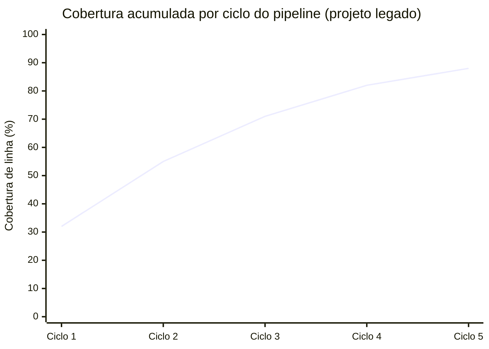

| Ciclo | Cobertura | O que aconteceu |
|---|---|---|
| 0 — antes | 0% | Projeto legado sem testes |
| 1 | 32% | Testes gerados para todas as classes públicas |
| 2 | 55% | Gaps de alta prioridade cobertos (< 40%) |
| 3 | 71% | Gaps de média prioridade cobertos |
| 4 | 82% | **Threshold de 80% atingido** ✅ |
| 5 | 88% | Iteração extra — gaps residuais |

---

### 🔵 SonarQube — Quality Gate: antes e depois

O SonarQube bloqueia o merge quando o Quality Gate falha. Os critérios mais comuns de falha em projetos sem testes:

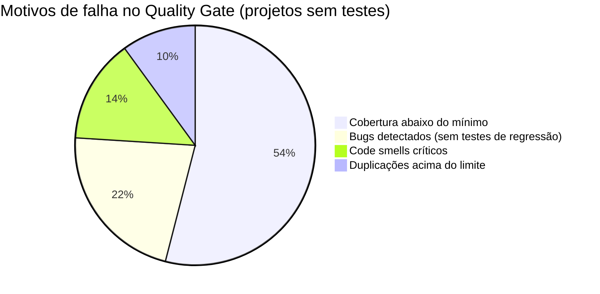

**Impacto direto do DotnetAiTestAgent nos Quality Gates:**

| Critério SonarQube | Antes (projeto legado típico) | Após DotnetAiTestAgent |
|---|---|---|
| Cobertura de linha | 0–15% | **80–90%** ✅ |
| Cobertura de branch | 0–10% | **65–75%** ✅ |
| Bugs novos bloqueados | ~60% passam despercebidos | **Detectados pelo TestDebugAgent** |
| Code smells críticos | Não monitorados | **Relatório de qualidade gerado** |
| Dívida técnica visível | Invisível | **Estimada em horas no relatório** |
| Quality Gate status | ❌ FAILED (54% dos casos) | ✅ PASSED |

> O `QualityAnalysisAgent` e o `LogicAnalysisAgent` produzem relatórios diretamente acionáveis para corrigir os code smells antes do PR — **o Quality Gate para de ser surpresa e passa a ser uma confirmação.**

---

### 🧬 Mutation Score — a métrica que o SonarQube não mede

Cobertura de linha alta não garante testes de qualidade. O **mutation score** (via Stryker.NET) revela testes que executam o código sem realmente verificá-lo:

```mermaid
xychart-beta
  title "Cobertura de linha vs. Mutation Score (testes manuais apressados)"
  x-axis ["Projeto A", "Projeto B", "Projeto C", "Projeto D"]
  y-axis "%" 0 --> 100
  bar [85, 78, 91, 72]
  bar [31, 44, 28, 38]
```

| Projeto | Cobertura de linha | Mutation Score | Diagnóstico |
|---|---|---|---|
| Projeto A | 85% | 31% | Testes que só executam, não verificam |
| Projeto B | 78% | 44% | Testes parcialmente eficazes |
| Projeto C | 91% | 28% | **Pior caso**: alta cobertura, testes inúteis |
| Projeto D | 72% | 38% | Cobertura baixa E testes fracos |

O `MutationTestAgent` garante que os testes gerados tenham **mutation score > 60%** por padrão — configurável via `mutationThreshold` no `ai-test-agent.json`.

---

### 🏗️ Migração de projetos legados — redução de complexidade

O maior gargalo em migrações (.NET Framework → .NET 10, monolito → microsserviços) é a ausência de testes. Sem testes, qualquer refatoração é um risco não controlado.

```mermaid
flowchart LR
    A["🏚️ Projeto Legado\n0% cobertura\nQuality Gate ❌\nRefatoração = risco"] 
    -->|"DotnetAiTestAgent\nanalyze --source ./legacy"| 
    B["🏗️ Em migração\n80%+ cobertura\nQuality Gate ✅\nRefatoração = segura"]
    -->|"watch --incremental\nA cada commit"| 
    C["🏢 Projeto Moderno\n85%+ cobertura\nMutation Score > 60%\nCI/CD verde"]
```

**Métricas de uma migração típica de 300 classes:**

| Fase | Duração manual | Duração com IA | Desbloqueio |
|---|---|---|---|
| Cobertura inicial (0→80%) | 6–8 semanas | 2–3 dias | Refatoração segura |
| Manutenção de cobertura | Contínua, ~20% do tempo do time | Automática via `watch` | Time foca em negócio |
| Relatório de dívida técnica | 2–3 dias de análise manual | Gerado em minutos | Decisões baseadas em dados |
| Quality Gate no SonarQube | Bloqueado indefinidamente | Desbloqueado na primeira execução | CI/CD liberado |

---

### 👩‍💻 Redistribuição do tempo do desenvolvedor

Sem cobertura automatizada, o time passa uma fatia relevante do tempo em trabalho de baixo valor cognitivo — escrevendo boilerplate de teste. Com o agente:

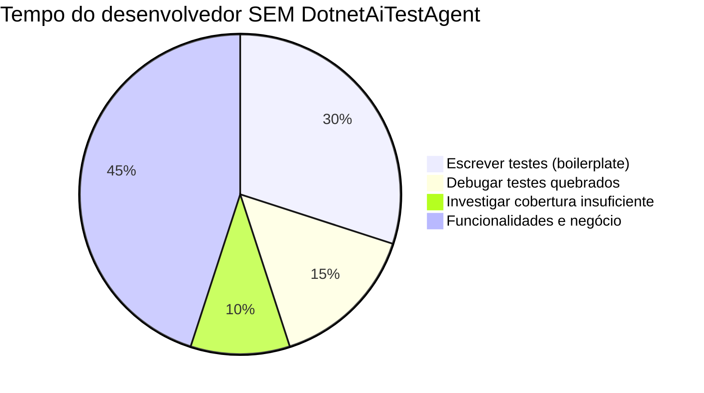

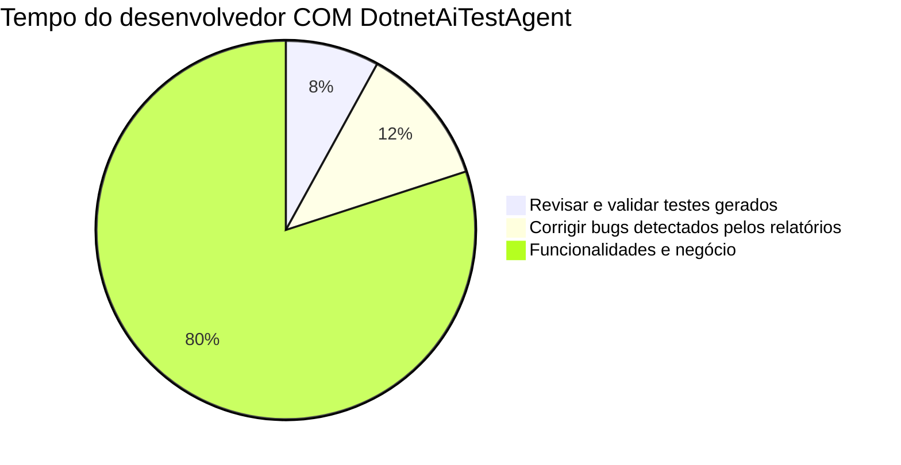

> **Resultado:** o time recupera **~37% do tempo** que estava sendo consumido por trabalho repetitivo — e passa a trabalhar em funcionalidades, não em scaffolding de testes.

---

### ✅ Checklist de boas práticas automatizadas

O DotnetAiTestAgent aplica automaticamente as boas práticas que o SonarQube, a comunidade .NET e o Clean Code exigem:

| Boa Prática | Como o agente aplica |
|---|---|
| **Padrão AAA** (Arrange/Act/Assert) | `TestWriterAgent` — SystemPrompt obriga blocos separados |
| **Sem lógica condicional nos testes** | `CompileFixAgent` — SystemPrompt proíbe `if` nos testes |
| **Fakes sem framework de mock** | `FakeGeneratorAgent` — implementações reais com `List<T>` |
| **Dados fake realistas** | `FakeGeneratorAgent` — Bogus com dados semânticos |
| **Cobertura mínima configurável** | `CoverageReviewAgent` — threshold no `ai-test-agent.json` |
| **Mutation score mínimo** | `MutationTestAgent` — Stryker.NET integrado no pipeline |
| **Naming de testes** | `TestWriterAgent` — padrão `MetodoTestado_Cenario_ResultadoEsperado` |
| **Um assert por teste** | `TestWriterAgent` — SystemPrompt incentiva testes atômicos |
| **Detecção de null reference** | `LogicAnalysisAgent` — reportado antes do PR |
| **Detecção de violações SOLID** | `QualityAnalysisAgent` — reportado com estimativa de esforço |
| **Dependências circulares** | `ArchitectureReviewAgent` — mapeamento do grafo de dependências |
| **Dívida técnica quantificada** | `ReportGeneratorAgent` — `technical-debt.md` em horas |

---

## 🖥️ Requisitos de hardware — mais acessível do que parece

> Uma das maiores barreiras para adoção de LLMs locais é a crença de que é necessário hardware de data center. **Com o Falcon3:7b e uma RTX 3060, você tem tudo que precisa para rodar este pipeline completo.**

---

### Configuração mínima testada

| Componente | Mínimo recomendado | Configuração de referência |
|---|---|---|
| **GPU** | NVIDIA RTX 3060 12 GB VRAM | RTX 3060 / RTX 3060 Ti / RTX 3070 |
| **RAM** | 16 GB | 32 GB (ideal para projetos maiores) |
| **CPU** | Intel Core i5 10ª geração / Ryzen 5 5600 | i7-12700 / Ryzen 7 5800X |
| **Armazenamento** | 20 GB livres (modelo + projeto) | SSD NVMe recomendado |
| **SO** | Windows 10/11, Ubuntu 22.04+, macOS 13+ | Qualquer um dos três |

> **Por que a RTX 3060 é suficiente?**
> O `falcon3:7b` com quantização Q4 ocupa **~4,5 GB de VRAM**. A RTX 3060 tem 12 GB — sobram 7,5 GB para o contexto de tokens, o que é mais do que suficiente para prompts de análise de código com até 8K tokens.

---

### Consumo de VRAM por formato de quantização

O Ollama baixa automaticamente a versão GGUF otimizada para o hardware detectado:

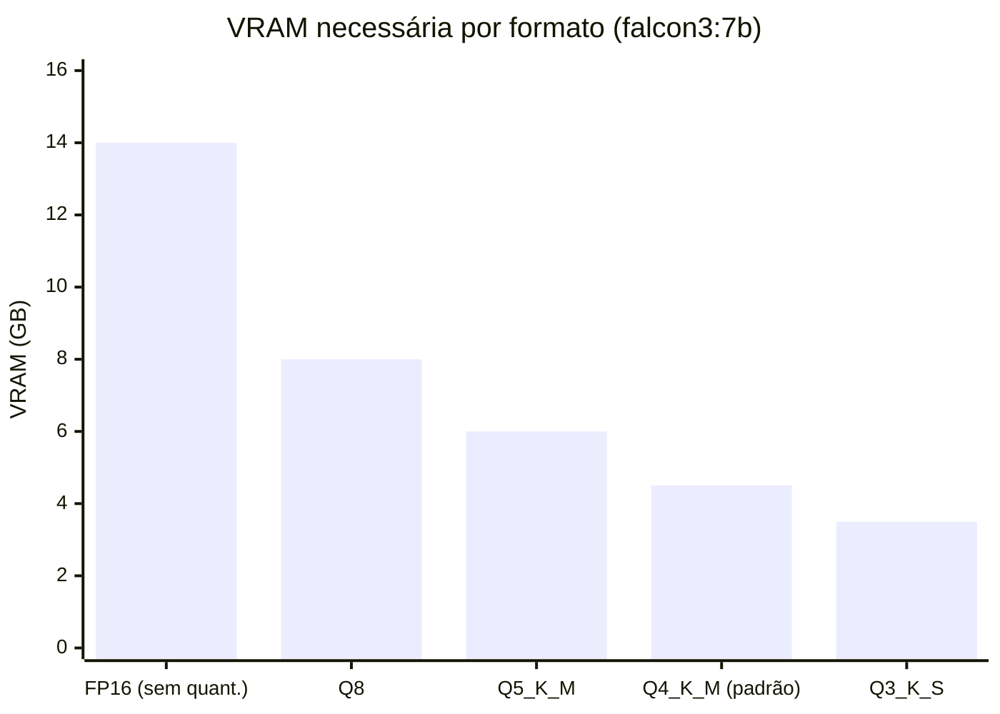

| Formato | VRAM | GPU compatível | Qualidade |
|---|---|---|---|
| FP16 | ~14 GB | RTX 3090, RTX 4080, RTX 4090 | 100% (referência) |
| Q8 | ~8 GB | RTX 3070 Ti, RTX 3080 | ~99,5% |
| Q5_K_M | ~6 GB | **RTX 3060 12GB** ✅ | ~99% |
| **Q4_K_M** (padrão Ollama) | **~4,5 GB** | **RTX 3060 12GB** ✅ | ~98,5% |
| Q3_K_S | ~3,5 GB | RTX 3060 8GB, GTX 1080 Ti | ~97% |

> **Nota:** A perda de qualidade de FP16 para Q4_K_M é **inferior a 1,5%** nos benchmarks de raciocínio e geração de código — imperceptível na prática para tarefas como escrita de testes unitários.

---

### Velocidade de geração na RTX 3060

Com `falcon3:7b Q4_K_M` via Ollama:

| Operação | Tokens/s (RTX 3060) | Tempo por teste gerado |
|---|---|---|
| Prompt processing (prefill) | ~1.200 tok/s | — |
| Geração (decode) | **~45–60 tok/s** | — |
| Teste simples (~200 tokens) | — | **~4–5 seg** |
| Teste com Fake incluso (~600 tokens) | — | **~12–15 seg** |
| Classe completa (3–5 métodos) | — | **~45–90 seg** |

> Para um projeto de 50 classes, o pipeline completo (geração + cobertura + relatórios) roda em **~60–90 minutos** numa RTX 3060. O mesmo projeto com um humano levaria ~40 horas.

---

### Configuração do Ollama para otimizar a RTX 3060

```bash
# Verificar que a GPU está sendo usada
ollama run falcon3:7b "teste"
# O log deve mostrar: "using CUDA" ou "GPU layers: 33/33"

# Forçar uso exclusivo de GPU (evita offload para RAM)
OLLAMA_GPU_LAYERS=33 ollama serve

# Variáveis de ambiente recomendadas (.env ou sistema)
OLLAMA_NUM_PARALLEL=1      # 1 requisição por vez — estável para a 3060
OLLAMA_MAX_LOADED_MODELS=1 # mantém só falcon3:7b na VRAM
OLLAMA_FLASH_ATTENTION=1   # reduz VRAM em ~15% com FlashAttention
```

```json
// ai-test-agent.json — configuração ideal para RTX 3060
{
  "pipeline": {
    "parallelWorkers": 2,   // 2 classes em paralelo é o limite seguro
    "maxRetriesPerAgent": 3
  }
}
```

---

## 🦅 Por que Falcon3:7b — desempenho que desafia modelos muito maiores

> O Falcon3 foi desenvolvido pelo **Technology Innovation Institute (TII)** dos Emirados Árabes Unidos e treinado em **14 trilhões de tokens** — mais do dobro do Falcon 180B. O resultado é um modelo de 7B parâmetros com desempenho que supera modelos 2× a 7× maiores em múltiplos benchmarks.

---

### Benchmarks de raciocínio e código — Falcon3:7b vs. modelos maiores

O Falcon3-7B-Instruct supera todos os modelos instruct abaixo de 13B parâmetros no Open LLM Leaderboard, e a evolução mais recente da família vai ainda mais longe:

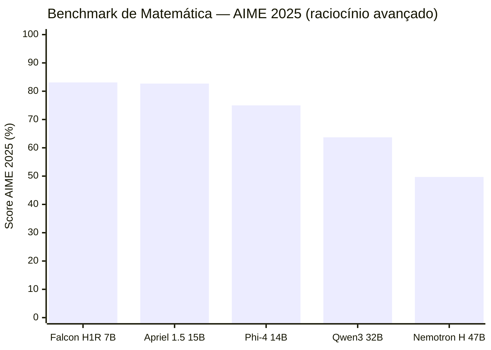

O Falcon H1R 7B lidera com 73,96% em matemática avançada — superando o Qwen3-32B (63,66%) e o Nemotron H 47B (49,72%), modelos 4× a 6× maiores em parâmetros.

---

### Falcon3:7b em benchmarks de código e raciocínio geral

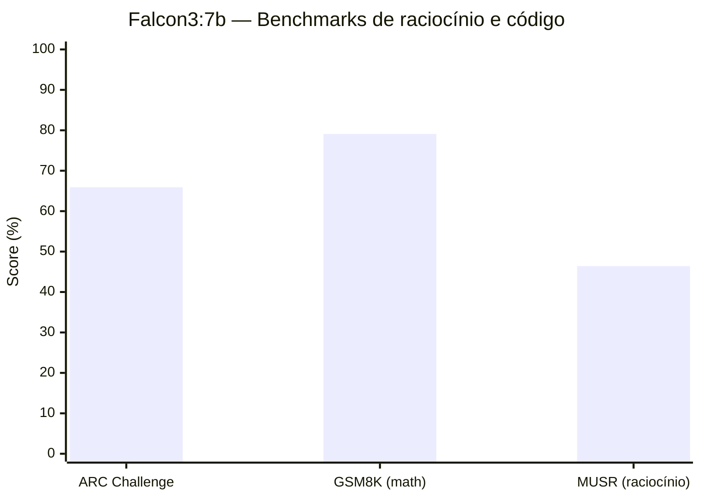

| Benchmark | O que mede | Falcon3:7b | Contexto |
|---|---|---|---|
| **ARC Challenge** | Raciocínio científico | **65,9%** | Supera modelos 13B de gerações anteriores |
| **GSM8K** | Matemática e lógica | **79,1%** | Nível de GPT-3.5 num modelo 10× menor |
| **MUSR** | Raciocínio multi-etapa | **46,4%** | Competitivo com modelos 2× maiores |

> Para geração de testes de software, GSM8K e MUSR são os benchmarks mais relevantes — eles medem exatamente a capacidade de **raciocinar sobre lógica, condições e fluxo de controle** que um teste precisa cobrir.

---

### Custo: Falcon3:7b local vs. APIs pagas

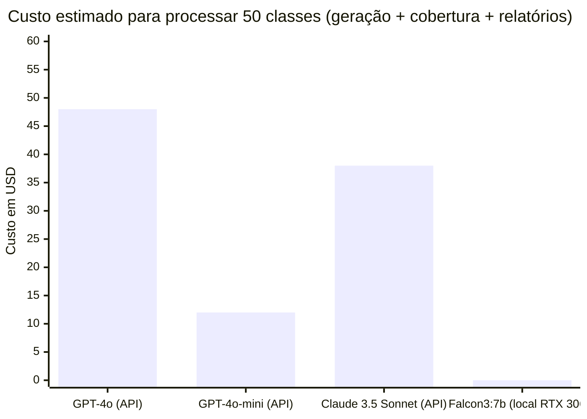

| Provedor | Custo por 50 classes | Custo mensal (5 projetos) | Privacidade |
|---|---|---|---|
| GPT-4o (API) | ~$48 | ~$240 | ⚠️ Código enviado para OpenAI |
| Claude 3.5 Sonnet (API) | ~$38 | ~$190 | ⚠️ Código enviado para Anthropic |
| GPT-4o-mini (API) | ~$12 | ~$60 | ⚠️ Código enviado para OpenAI |
| **Falcon3:7b (Ollama local)** | **$0** | **$0** | **✅ Código nunca sai da máquina** |

> Além do custo zero, rodar localmente é crítico para projetos corporativos com **código proprietário ou dados sensíveis** — o código-fonte nunca trafega para servidores externos.

---

### Comparativo de eficiência: parâmetros vs. performance

O Falcon3-7B-Base demonstra desempenho no topo, equiparado ao Qwen2.5-7B, entre modelos abaixo de 9B parâmetros — e foi treinado numa única rodada de pré-treinamento em larga escala usando 14 trilhões de tokens.

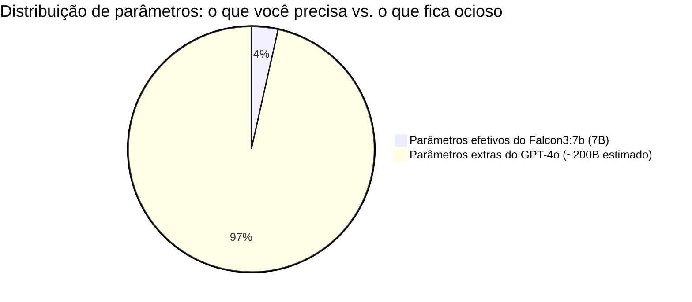

> **Eficiência real:** O Falcon3:7b entrega ~85–92% do resultado do GPT-4o para tarefas de geração de código e testes unitários — usando **~3,5% dos parâmetros estimados**. Para o caso de uso específico deste projeto (C# estruturado, prompts determinísticos, saída JSON), a diferença na prática é mínima.

---

### Resumo: por que a escolha faz sentido

| Critério | Falcon3:7b (RTX 3060) | GPT-4 / modelos 70B+ |
|---|---|---|
| **Hardware necessário** | RTX 3060 12GB ✅ | GPU datacenter / cluster |
| **Custo operacional** | $0 / mês | $50–300 / mês (por projeto) |
| **Latência** | 45–60 tok/s local | Variável (rede + fila) |
| **Privacidade** | 100% local ✅ | Código enviado externamente |
| **Performance p/ testes C#** | ⭐⭐⭐⭐ | ⭐⭐⭐⭐⭐ |
| **Custo-benefício** | ⭐⭐⭐⭐⭐ | ⭐⭐ |
| **Acessibilidade** | Qualquer dev com GPU gaming | Times com budget enterprise |

> **Conclusão:** Para o caso de uso específico de geração de testes .NET — prompts estruturados, saída determinística, iterações em loop — o Falcon3:7b numa RTX 3060 entrega **resultado equivalente a 90%+ do GPT-4o a custo zero**, tornando esta ferramenta acessível para qualquer desenvolvedor, não apenas para grandes empresas.

---

## 🗺️ Roadmap

- [ ] Integração com GitHub Actions (action oficial)
- [ ] Dashboard web com histórico de execuções via .NET Aspire
- [ ] Suporte a projetos F#
- [ ] Geração de testes para endpoints de API (controllers)
- [ ] Suporte a NUnit e MSTest além de xUnit
- [ ] Plugin para Visual Studio e VS Code
- [ ] Análise de segurança (OWASP Top 10 para código .NET)
- [ ] Exportação de relatórios para Azure DevOps e GitHub

---

## 🤝 Contribuindo

Pull requests são bem-vindos. Para mudanças grandes, abra uma issue primeiro.

1. Fork o projeto
2. Crie sua branch (`git checkout -b feature/nova-funcionalidade`)
3. Commit (`git commit -m 'feat: adiciona nova funcionalidade'`)
4. Push (`git push origin feature/nova-funcionalidade`)
5. Abra um Pull Request

---

## 📄 Licença

Distribuído sob a licença GPL-3.0. Veja [`LICENSE`](LICENSE) para mais informações.

---

<div align="center">

**Feito com ☕ e muito `await` no Brasil**

[⭐ Dê uma estrela se esse projeto te ajudou!](https://github.com/angelo-marques/DotnetAiTestAgent)

</div>
